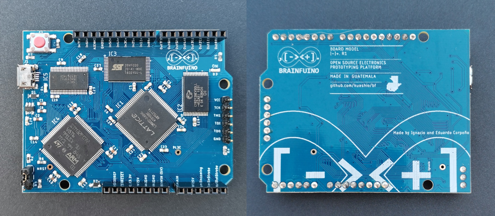

# Brainfuino [-]+.
An Arduino competitor that runs native brainfuck! I've condensed the explanation in this video: https://youtu.be/QloNq8AoHvU

Before going further, please make sure you know (or remember) what brainfuck is. [Here's Wikipedia's entry as a refresher](https://en.wikipedia.org/wiki/Brainfuck).

Also, before moving forward: This is not a joke. It ***is*** about a joke programming language, but a joke lots of nerds are very fond of. When I say nerds, I mean real geeks: Not gamers or technophiles, but geeks who like to read [The Art of Computer Programming](https://en.wikipedia.org/wiki/The_Art_of_Computer_Programming) just for kicks!

The Brainfuino [-]+. (pronounced "Brainfuino Uno") is a development board for a brainfuck soft processor I wrote in Verilog, named [***brainfuck_uP***](https://github.com/kuashio/brainfuck_uP) (as in "brainfuck microprocessor"), which runs brainfuck code natively, that is, the plain text of a brainfuck source file, yes, ascii characters.

Here are some details:

- brainfuck_uP is implemented in a Lattice MachXO2 FPGA, very much like the one in the [TinyFPGA AX2](https://www.sparkfun.com/products/14828) board, but in a TQFP100 package.
- brainfuck_uP is a *Harvard* machine, so it has two separate buses for its program and data memories. 
- The Brainfuino has a 128kB RAM chip and a 256kB chip, both with a good old parallel interface to work as the data and program memories of brainfuck_uP respectively.
- The I/O is adapted from 3.3V logic to TTL with a separate chip (to resemble the Arduino Uno).
- The host computer interface is a USB Virtual COM port implemented with an STM32F072 MCU, which overrides the input/output ports of brainfuck_uP for easy user-brainfuck interaction.
- The MCU is also donating its ADC to give Brainfuino the power of analog input. 
- The board has hardware for updating both the MCU firmware and the FPGA design.

## Advantages over the Arduino Uno

This product is intended as anything around brainfuck and esoteric programming languages: A joke. An elaborate joke. A geek toy.

So, if we take the Arduino as a competitor, here are some advantages:

- Brainfuino runs brainfuck! You'll get to learn a classic esoteric programming language.
- Brainfuino is the only brainfuck MCU platform of its kind (that I know of).
- Brainfuino is capable of at least competing with the Arduino by having an analog input channel.
- Brainfuino may serve as a teaching tool for several things: FPGA soft-processor development, computer science, esoteric programming languages, tinkering, hardware, etc.
- Lots of fun by matching the Arduino Community's codebase.
- Bragging rights for writing code that works! You certainly won't get that from the Arduino. 
- A *Guinness Record* may come out from the Brainfuino Community. Think an Operating System, or an actual home security system!

## Computer Languages

There are three computer languages involved. Only the first one is really intended for the end-user:

- **brainfuck:** Users will write their code in brainfuck, and the Brainfuino will run it.
- **Verilog:** brainfuck_uP was written in Verilog. The final .jedec file may be written into the FPGA's internal ROM at any time.
- **C/C++:** The firmware in the STM32 MCU was written in C. This firmware can be written into the MCU at any time as well.

## Related Projects

- [brainfuck_uP](https://github.com/kuashio/brainfuck_up). The soft processor running on the Brainfuino.
- [Brainfuino MCU firmware](https://github.com/kuashio/brainfuino-firmware). The firmware running in the STM32F072 MCU.

- Visual brainfuck. A brainfuck IDE I finished back in 2011.

## Contact

Eduardo Corpeño

For bug report or anything related to Brainfuino, I may be reached at kuashio@gmail.com 

